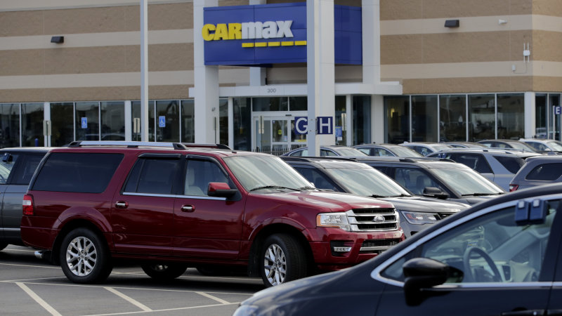

  

### Load and Clean the Dataset
```{r, message=FALSE, warning=FALSE}
# set up python env
library(reticulate)
use_python('/Library/Frameworks/Python.framework/Versions/3.7/bin/python3')
```

```{python}
# load the data
import pandas as pd
pd.set_option('display.max_columns', None)
cars = pd.read_csv('used_car.csv')
# get to know about the data
cars.head()
```

```{python}
# remove some meaningless columns and reduplicate columns
del cars['vin']
del cars['engine']
del cars['location']
del cars['mpg_city_highway']
del cars['stock']
# check NA values
cars.isnull().sum().sum()
```

### EDA Visualization - Learning about Features of Used  Cars

#### 1.Body Style
```{r}
# visualize categorical type of features of used cars
# learn about "body_style" feature
cars = py$cars
table(cars$body_style)
```
```{r,message=FALSE, warning=FALSE}
# remove outliers - 'Chassis' body_style
cars = subset(cars, body_style != 'Chassis')
# plot
library(ggplot2)
library(wesanderson)
theme_update(plot.title = element_text(hjust = 0.5))
ggplot(cars, aes(x=body_style,color=body_style)) +
  geom_bar(fill='white') +
  geom_text(stat='count', aes(label=..count..), vjust=-1,size=5,position = position_dodge(0.9))+
  scale_fill_manual(values=wes_palette(n=3, name="Royal2")) +
  scale_y_continuous(limits = c(0, 12000)) +
  labs(title = 'Barplot of Body Style', x='Body Style', y='Count')
```

#### 2. Drive Type
```{r}
# learn about 'drive_type' feature
table(cars$drive_type)
```
```{r}
# remove outliers - 'Unspecified' drive_type
cars = subset(cars, drive_type != 'Unspecified')
# Since both '4WD' and 'AWD' mean all wheels drive, we combine them together
library(plyr)
cars$drive_type <- revalue(cars$drive_type, c('4WD' = 'AWD'))
# plot
ggplot(cars, aes(x=drive_type,color=drive_type)) +
  geom_bar(fill='white') +
  geom_text(stat='count', aes(label=..count..), vjust=-1,size=5,position = position_dodge(0.9))+
  scale_fill_manual(values=wes_palette(n=3, name="Royal2")) +
  scale_y_continuous(limits = c(0, 12000)) +
  ggtitle('Barplot of Drive Type')
```

#### 3. Exterior Color & Interior Color
```{r}
# learn about 'ext_color' feature
table(cars$ext_color)
```
```{r, message=FALSE, warning=FALSE}
library("dplyr")
# plot pie chart of "ext_color" feature
ec_df = data.frame(table(cars$ext_color)) # create a dataframe
names(ec_df) <- c('Color', 'Count') # rename column name
ec_df$Color <- as.character(ec_df$Color) # convert column type
ec_df$Per <- round(ec_df$Count / sum(ec_df$Count) * 100, 1) # compute the percentage
ec_df <- subset(ec_df, Per != 0) # remove color with 0 percentage
# sort based on percentage
ec_df <- ec_df[order(-ec_df$Count),]

# combine minority color to 'Other'
sum_count = sum(ec_df$Count)
other_count = sum_count - 6034 - 5307 - 4297 - 4014 - 2086 - 2036
other_per = round(other_count/sum_count*100, 1)
newRow <- c('Other',(other_count), (other_per)) # combine those counts less than 1k
ec <- rbind(ec_df[1:6,], newRow)
ec$Count = as.integer(ec$Count)
ec$Per = as.numeric(ec$Per)
```

```{r}
# add label position
ec <- ec %>%
  arrange(desc(Color)) %>%
  mutate(lab.ypos = cumsum(Per) - 0.5*Per)

# plot
mycols <- c('gray12', 'royalblue2', 'dimgray', 'violet', 'red3', 'gray77', 'gray96') # Other - violet
ggplot(ec, aes(x = "", y = Per, fill = Color)) +
  geom_bar(width = 1, stat = "identity", color = "white") +
  coord_polar("y", start = 0)+
  geom_text(aes(y = lab.ypos, label = Per), color = "cyan")+
  scale_fill_manual(values = mycols) +
  theme_void() +
  theme(plot.title = element_text(hjust = 0.5))+
  ggtitle('Pie Chart of External Color')
```

```{r}
# learn about 'int_color' feature
table(cars$int_color)
```
```{r}
# plot pie chart of "int_color" feature
ic_df = data.frame(table(cars$int_color)) # create a dataframe
names(ic_df) <- c('Color', 'Count') # rename column name
ic_df$Color <- as.character(ic_df$Color) # convert column type
ic_df$Per <- round(ic_df$Count / sum(ic_df$Count) * 100, 1) # compute the percentage
ic_df <- subset(ic_df, Per != 0) # remove color with 0 percentage
# sort based on percentage
ic_df <- ic_df[order(-ic_df$Count),]

# combine minority color and unspecified color to 'Other'
sum_count = sum(ic_df$Count)
other_count = sum_count - 11412 - 4650 - 2728
other_per = round(other_count/sum_count*100, 1)
newRow <- c('Other',(other_count), (other_per))
ic <- rbind(ic_df[1,], newRow)
ic <- rbind(ic, ic_df[3:4, ])
ic$Count = as.integer(ic$Count)
ic$Per = as.numeric(ic$Per)
```


```{r}
# add label position
ic <- ic %>%
  arrange(desc(Color)) %>%
  mutate(lab.ypos = cumsum(Per) - 0.5*Per)

# plot
mycols <- c('gray12', 'dimgray', 'violet', '#D2B48C') # Other - violet
ggplot(ic, aes(x = "", y = Per, fill = Color)) +
  geom_bar(width = 1, stat = "identity", color = "white") +
  coord_polar("y", start = 0)+
  geom_text(aes(y = lab.ypos, label = Per), color = "cyan")+
  scale_fill_manual(values = mycols) +
  theme_void() +
  theme(plot.title = element_text(hjust = 0.5)) +
  ggtitle('Pie Chart of Internal Color')
```

#### 4. Fuel
```{r}
# learn about "fuel" feature
table(cars$fuel)
```

```{r}
# remove outliers
cars = subset(cars, fuel != 'Alternative')
fuel_tbl = table(cars$fuel)

# waffle plot
library(waffle)
waffle(fuel_tbl/200, rows = 7,, xlab = '1 square = 200 cars', title = 'Waffle Plot of Used Cars Fuel Type')+theme(plot.title = element_text(hjust = 0.5))
```

#### 5. City MPG & Highway MPG
```{r}
# learn about "transmisison" feature
table(cars$transmission)
```
```{r,message=FALSE, warning=FALSE}
library(ggpubr)
library(cowplot)
# remove 'Unspecified' cars
cars = subset(cars, transmission != 'Unspecified')
# remove MPG == 0
cars = subset(cars, City_MPG != 0)
cars = subset(cars, Highway_MPG != 0)
# Scatter Plots
plot1 <- ggplot(cars, aes(x = City_MPG, y = Highway_MPG)) +
  geom_count(aes(color = transmission))+
  theme(plot.title = element_text(hjust = 0.5))+
  theme_light()+ theme(plot.title = element_text(hjust = 0.5)) +
  ggtitle('Scatter Plot of MPG based on Different Transmission')
plot2 <- ggplot(cars, aes(x = City_MPG, y = Highway_MPG)) +
  geom_count(aes(color = drive_type))+
  theme_pubclean()+ theme(plot.title = element_text(hjust = 0.5)) +
  ggtitle('Scatter Plot of MPG based on Different Drive Type')
plot3 <- ggplot(cars, aes(x = City_MPG, y = Highway_MPG)) +
  geom_count(aes(color = fuel))+
  theme_half_open()+ theme(plot.title = element_text(hjust = 0.5)) +
  ggtitle('Scatter Plot of MPG based on Different Fuel Type')
plot4 <- ggplot(cars, aes(x = City_MPG, y = Highway_MPG)) +
  geom_count(aes(color = factor(Num_Cyl)))+
  theme_bw()+ theme(plot.title = element_text(hjust = 0.5)) +
  ggtitle('Scatter Plot of MPG based on Different #ofCylinders')
plot1
plot2
plot3
plot4
```

#### 6. Price & Year
```{r}
# learn about distribution of milage and price (continuous feature)
ggplot(cars, aes(x=price)) +
    geom_histogram(binwidth = 5000, color='red', fill='royalblue3')+
    theme_half_open()+ theme(plot.title = element_text(hjust = 0.5))+ ylim(c(0,6000))+
    labs(title='Distribution of Used Cars Price', y='Count', x='Price(USD)')
```

```{r, message=FALSE, warning=FALSE}
# learn about 'year'
pp <- ggplot(data=cars, aes(x=year)) + 
      geom_bar(aes(y = (..count..)/sum(..count..)), fill='lightpink2')+ xlim(c(2000, 2020)) +
      labs(title= 'Bar Plot of Used Car Year')+ ylab('Percentage')+xlab('Year')+
      theme_pubclean() + theme(plot.title = element_text(hjust = 0.5))
library(scales)
pp + scale_y_continuous(labels = percent) + coord_flip()
```


```{r, warning=FALSE, message=FALSE}
## hex
ggplot(cars, aes(year, price))+
  geom_hex(bins=20)+theme(plot.title = element_text(hjust = 0.5))+
  theme(plot.subtitle = element_text(hjust = 0.5))+ xlim(c(2000,2020))+ ylim(c(2000,80000))+
  labs(title='Price Density Hex Plot', subtitle = 'accordigng to year', y='Price(USD)', x='Year')
```

#### 7. Make & Model (TextViz - 'word cloud')
```{r}
# word cloud - car 'make' and 'model'
write.table(cars$make, "make.txt", sep="\t",row.names=FALSE, quote = FALSE)
write.table(cars$model,"model.txt",sep="\t",row.names=FALSE, quote = FALSE)
```

```{r, message=FALSE, warning=FALSE}
# generate the car make and model word cloud
library(tm)
library(SnowballC)
library(wordcloud2)
library(RColorBrewer)
# Read the text file
make_text = readLines('make.txt')
model_text = readLines('model.txt')
# Load the data as a corpus
doc <- Corpus(VectorSource(make_text))
docs <- Corpus(VectorSource(model_text))
# inspect(docs)

## Make
dtm_ <- TermDocumentMatrix(doc)
m_ <- as.matrix(dtm_)
v_ <- sort(rowSums(m_),decreasing=TRUE)
d_ <- data.frame(word = names(v_),freq=v_)
## Model
dtm <- TermDocumentMatrix(docs)
m <- as.matrix(dtm)
v <- sort(rowSums(m),decreasing=TRUE)
d <- data.frame(word = names(v),freq=v)

# generate the word cloud - Make
wordcloud2(d_, size= 1, color = 'random-light', backgroundColor = 'grey')
```


```{r}
# generate the word cloud
wordcloud2(d, size= 0.9, color = 'random-dark', shape = 'diamond')
```


### Task Visualization

#### 1. Fuel Economy Anlysis of the 20 Most Polular Used Car Models 


```{python}
# Special Task
## Data Prep
# load in original data
import numpy as np
import pandas as pd
vh = pd.read_csv('used_car.csv')
# top 20 cars - List
car_list= ["F-150", "3Series", "Civic","Malibu","Accord","Camry","Focus","Escape","Altima","C-Class","Rogue","Explorer","Passat","Tucson","CR-V","Sonata","Corolla","Fusion","Cruze","Jetta"]
# mean City MPG of each car - List
mpg_list = []
for v in car_list:
    mpg_list.append(round(np.mean(vh['City_MPG'][vh['model'] == v].values), 2))
vh = pd.DataFrame({'name': car_list, 'mpg': mpg_list})
```


```{r}
vh = py$vh
theme_set(theme_bw())  

# Data Prep Cont...
vh$mpg_z <- round((vh$mpg - mean(vh$mpg))/sd(vh$mpg), 2)  # compute normalized mpg
vh$mpg_type <- ifelse(vh$mpg_z < 0, "below", "above")  # above / below avg flag
vh <- vh[order(vh$mpg_z), ]  # sort
vh$name <- factor(vh$name, levels = vh$name)  # convert to factor to retain sorted order in plot.

# Diverging Barcharts
ggplot(vh, aes(x=name, y=mpg_z, label=mpg_z)) + 
  geom_bar(stat='identity', aes(fill=mpg_type), width=.5)  +
  scale_fill_manual(name="MPG", 
                    labels = c("Above Average", "Below Average"), 
                    values = c("above"="#00ba38", "below"="#f8766d")) +
  theme(plot.title = element_text(hjust = 0.5))+
  theme(plot.subtitle = element_text(hjust = 0.5))+
  labs(title= "Analysis of Top 20 Models City MPG", subtitle = "Top 20 Most Popular Models in the Used Cars Market") + coord_flip()+
  ylab('Normalized MPG') + xlab('Model')
```

From the chart above, we can clearly see that basic entry-level models such as Civic and Corolla are relatively fuel-efficient for daily transportation; in addition, big pickup trucks such as F150, other SUVs, and German high-end sedans are more fuel-costly.

#### 2. 3 Polular Used Car Models Price Trend Visualization
```{python}
t2 = pd.read_csv('used_car.csv')
# civic
t2_civic = t2[t2['model'] == 'Civic']
civic_year = sorted([2015,2016,2017,2013,2014,2012,2010,2008,2009,2011,2006,2007,2004,2005,2003,2013])
civic_price = []
for y in civic_year:
    civic_price.append(int(np.mean(t2_civic['price'][t2_civic['year'] == y].values)))
civic_model = ['Civic','Civic','Civic','Civic','Civic','Civic','Civic','Civic','Civic','Civic','Civic','Civic','Civic','Civic','Civic','Civic']
civic = pd.DataFrame({'year': civic_year, 'price': civic_price, 'model':civic_model})
# corolla
t2_corolla = t2[t2['model'] == 'Corolla']
corolla_year = sorted([2015,2016,2017,2013,2010,2014,2018,2011,2005,2012,2009,2007,2006,2004,2002,2008])
corolla_price = []
for y in corolla_year:
    corolla_price.append(int(np.mean(t2_corolla['price'][t2_corolla['year'] == y].values)))
corolla_model = ['Corolla','Corolla','Corolla','Corolla','Corolla','Corolla','Corolla','Corolla','Corolla','Corolla','Corolla','Corolla','Corolla','Corolla','Corolla','Corolla']
corolla = pd.DataFrame({'year': corolla_year, 'price': corolla_price, 'model':corolla_model})
# explorer
t2_explorer = t2[t2['model'] == 'Explorer']
explorer_year = sorted([2015,2016,2014,2017,2013,2012,2011,2007,2003,2018,2008,2010,2006,2005,2004,2002])
explorer_price = []
for y in explorer_year:
    explorer_price.append(int(np.mean(t2_explorer['price'][t2_explorer['year'] == y].values)))
explorer_model = ['Explorer','Explorer','Explorer','Explorer','Explorer','Explorer','Explorer','Explorer','Explorer','Explorer','Explorer','Explorer','Explorer','Explorer','Explorer','Explorer']
explorer = pd.DataFrame({'year': explorer_year, 'price': explorer_price, 'model':explorer_model})
task2 = pd.concat([civic, corolla, explorer])
```


```{r}
library(plotly)

task2=py$task2
# plot
fig <- plot_ly(task2, x = ~year, y = ~price, color= ~model, type = 'scatter', mode = 'lines')

fig <- fig %>%  layout(title = '3 Polular Used Car Models Price Trend Plot', 
                       yaxis = list(title = 'Price'), 
                       xaxis = list(autorange='reversed'))
                       
fig
```

As can be seen from the line chart above, Japanese-brand entry-level sedans, such as Corolla, Civic, have a large quantity in the used car market, so their prices will undoubtedly decrease with the time of use.  
In addition, we have an interesting findings. As Ford's main SUV model--Explorer, its 2006 model is more expensive than the 2007 model in the used car market. I checked some information and found that the Explorer had a new generation in 2006. The sales performance of the fourth-generation Explorer(2006) going on the market continued the decline of the third-generation model, and it did not achieve good reputation when it was launched. Moreover, Coupled with the 2008 financial crisis that followed, the quantity of 2006 Explorer in the market can be said to be very small, which may cause its price to be higher than 2007, 2008 version. If you want to know more information about explorer, you can check the link below:  
'https://www.topspeed.com/cars/six-generations-of-the-ford-explorer-ar184141.html'  


#### 3. Geospatial - Registered Autos by County in California
If you are considering buying or selling a used car, you must want to know about the car ownership near where you are. Let’s take California as an example to see how many vehicles there are in each county in California.  
Data reference: "https://www.dmv.ca.gov/portal/uploads/2020/06/2019-Estimated-Vehicles-Registered-by-County-1.pdf".  

```{r, message=FALSE, warning=FALSE}
library(sf)
library(dplyr)
options(scipen = 999)
ca_shape_map = st_read('CA_Counties/CA_counties_TIGER2016.shp', stringsAsFactors = FALSE)
```


```{r}
t3 = read.csv('ESTIMATED_AUTOS_REGISTERED_BY_COUNTY.csv') # read in data
t3$Percentage1000 <- t3$Autos/sum(t3$Autos) *1000
t3_ = inner_join(ca_shape_map, t3, by='NAME')

t3_plot = ggplot(t3_)+
  geom_sf(aes(fill= Percentage1000))+
  scale_fill_gradient(low = '#99CCFF', high = '#003366')+
  labs(title='Estimated Autos Registered by County in California-2019')
t3_plot
```
~  

Los Angeles County has the most newly registered cars, and the number is overwhelming.  


#### 4. Network Analysis
##### Top 8 California Cities have the most BMW, Toyota, Ford Used Cars
```{python}
# data prepare
t4 = pd.read_csv('used_car.csv')
# CA
t4 = t4[t4['State'] == 'CA']
# Ford
t4_ford = t4[t4['make'] == 'Ford']
t4_ford_city = t4_ford['City'].value_counts().keys().tolist()[0:8]
t4_ford_count = t4_ford['City'].value_counts().tolist()[0:8]
t4_ford_list = ['Ford','Ford','Ford','Ford','Ford','Ford','Ford','Ford']
ford_top8 = pd.DataFrame({'Make': t4_ford_list, 'City': t4_ford_city, 'Count':t4_ford_count})
# Toyota
t4_toyota = t4[t4['make'] == 'Toyota']
t4_toyota_city = t4_toyota['City'].value_counts().keys().tolist()[0:8]
t4_toyota_count = t4_toyota['City'].value_counts().tolist()[0:8]
t4_toyota_list = ['Toyota','Toyota','Toyota','Toyota','Toyota','Toyota','Toyota','Toyota']
toyota_top8 = pd.DataFrame({'Make': t4_toyota_list, 'City': t4_toyota_city, 'Count':t4_toyota_count})
# BMW
t4_bmw = t4[t4['make'] == 'BMW']
t4_bmw_city = t4_bmw['City'].value_counts().keys().tolist()[0:8]
t4_bmw_count = t4_bmw['City'].value_counts().tolist()[0:8]
t4_bmw_list = ['BMW','BMW','BMW','BMW','BMW','BMW','BMW','BMW']
bmw_top8 = pd.DataFrame({'Make': t4_bmw_list, 'City': t4_bmw_city, 'Count':t4_bmw_count})
top8 = pd.concat([ford_top8,toyota_top8,bmw_top8])
```
```{r,message=FALSE, warning=FALSE}
# transfer data to r env
flow = py$top8
flow$Count = ((flow$Count - min(flow$Count)) / (max(flow$Count) - min(flow$Count))) / 2 # convert for visualization
```

```{r, message=FALSE, warning=FALSE}
# start to plot 
library(tidygraph)
library(stringr)
library(ggraph)
graph_flow <- as_tbl_graph(flow)

graph_flow <- graph_flow %>%
  activate(nodes) %>%
  mutate(
    title = str_to_title(name),
    label = str_replace_all(title, " ", "\n")
    )
# set theme
thm <- theme_minimal() +
  theme(
    legend.position = "none",
     axis.title = element_blank(),
     axis.text = element_blank(),
     panel.grid = element_blank(),
     panel.grid.major = element_blank(),
  ) 

theme_set(thm)

# plot
graph_flow %>%
  ggraph(layout = 'kk') +
    geom_edge_diagonal(aes(colour = factor(from), width = Count), alpha=0.4, ends = "last", type = "open") +
    geom_node_text(aes(label = label, color = name, fontface='bold'), size = 3.8) +
    labs(title = 'Top 8 California Cities/Neighborhood have the most BMW, Toyota, Ford Used Cars')
```
