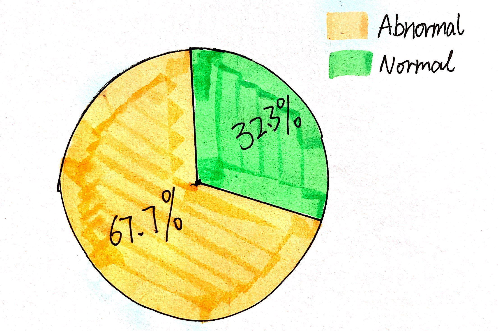
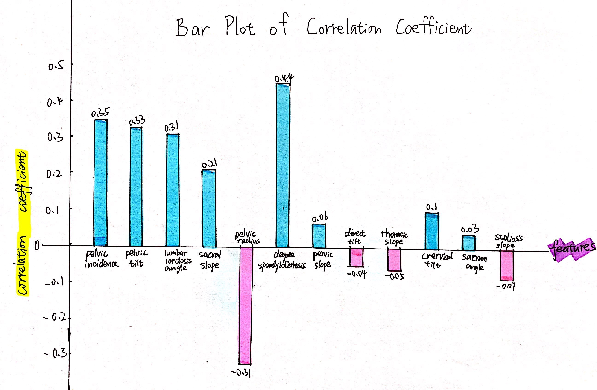
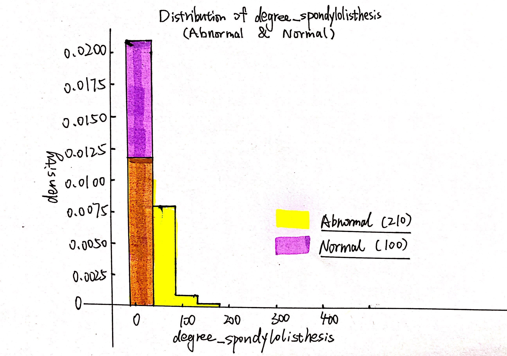
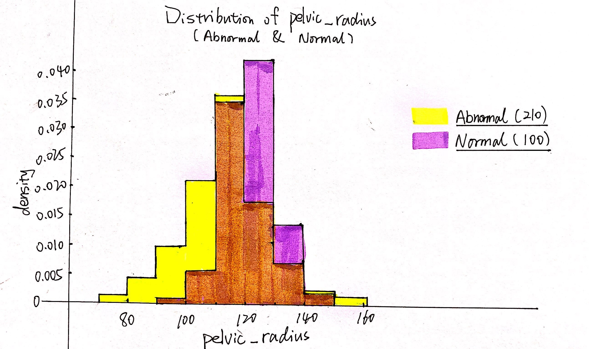
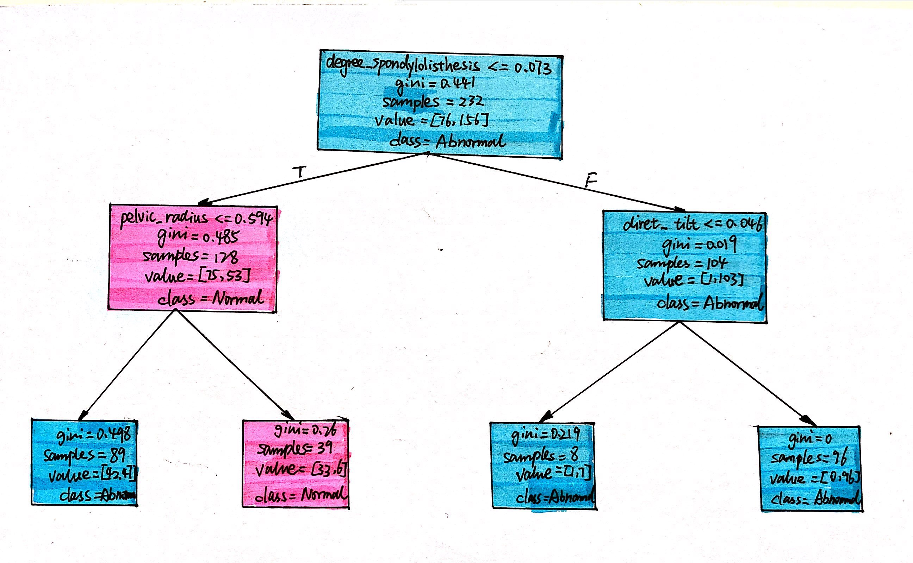

"Dataset_spine.csv" is a highly-structrued dataset with 13 features of 310 patients and 1 target variable,"class_attribute", which implies whether the patient is normal or not. Each feature may not be very familiar to us, they are some measurements of human body. It is clear that this dataset is used for binary classification problem.  

Among these 310 patients, 210 (67.7%) are abnormal, while others (32.3%) are normal.  

Looking back to those 13 features, I was wondering which would be the most related features. Thus, I got the correlation coeffient with the help of the computer and plot the following bar plot.  

  

We can learn that "degree_spondylolisthesis" is the most positive related feature, while "pelvic_radius" is the most negative related feature. To further explore the difference between positive correlation and negative correlation, I simply draw the distributions (histograms) of these two features.  

We can learn from the above two histograms that for "degree_spondylolisthesis",  the smaller its value is, the less likely the patient is to be abnormal; for "pelvic_radius", the closer its value is to the center of the distribution, the less likely the patient is to be abnormal.  

Last but not the least, to verify whether these two features are most relevant to our target variable, I build a simple classification decision tree model, make max_depth equal to 2, and hand-draw the tree which the model outputs. See the following image...  

We can see that those two features are being used at the very beginning for the model to classify.

